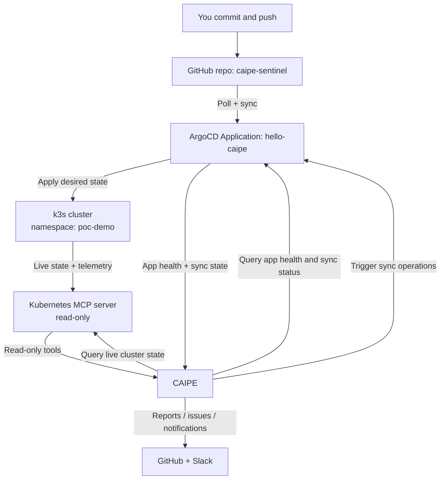

# 👁️🤖🦸 GitOps Sentinel + CAIPE

GitOps Sentinel is a demo repository for showcasing how CAIPE can support SRE-style maintenance of a Kubernetes application.

This project plays two roles at the same time:

1. It is the source repository that hosts all demo resources.
2. It is also the Git source watched by ArgoCD to deploy and reconcile the demo app in Kubernetes.

`In short:` you push changes here, ArgoCD applies them, and CAIPE observes, analyzes, and reports on operational state.

## Demo architecture



The components to build inside of your CAIPE instance are the following:


The demo app mounted on a k8s cluster is the following:


## What this demo proves

- 🚀 GitOps deployment flow through ArgoCD.
- 🔍 Safe read-only Kubernetes visibility for AI operations via MCP.
- 🤖 CAIPE-based operational workflows for health checks, drift detection, reporting, and notification.

## Repository map

This repo is intentionally compact. Every folder has a specific role:

| Path | Purpose |
|---|---|
| `app/` | Kubernetes manifests for the demo workload (`hello-caipe`) that ArgoCD deploys. |
| `argocd/` | ArgoCD manifests: the `Application` object and a NodePort service for ArgoCD UI access. |
| `deploy/` | Supporting infrastructure for the demo, including Kubernetes RBAC for the MCP server and MCP runtime config. |
| `scripts/` | Operational helper scripts for standing up the MCP server and intentionally creating drift/failure scenarios. |
| `agents/` | Backup copies of CAIPE agent instructions to onboard later through CAIPE Web UI. |
| `skills/` | Backup copy of CAIPE skills to onboard later through CAIPE Web UI. |
| `workflows/` | Backup copy of CAIPE workflow definitions to onboard later through CAIPE Web UI. |
| `secrets/` | Local generated secrets/artifacts (ignored by git), such as the MCP kubeconfig generated by setup scripts. |

## File-by-file script guide

### `scripts/run-kubernetes-mcp.sh`

Purpose:

- 🧩 Sets up and runs the Kubernetes MCP server as a standalone Docker container (not as a Pod).

What it does:

1. Validates required CLIs (`kubectl`, `docker`).
2. Detects the k3s node IP (or uses the one you pass as an argument).
3. Applies read-only RBAC from `deploy/k8s-mcp-rbac.yaml`.
4. Builds a kubeconfig at `secrets/kubernetes-mcp.kubeconfig`.
5. Uses a permanent ServiceAccount token from `mcp-viewer-token`.
6. Verifies read-only API access.
7. Ensures the CAIPE Docker network exists (default `ai-platform-engineering_default`, override with `CAIPE_NETWORK`).
8. Starts `ghcr.io/containers/kubernetes-mcp-server:v0.0.66` with locked-down runtime flags.

Resulting endpoints:

- 🌐 CAIPE network endpoint: `http://kubernetes-mcp:8080/mcp`
- 🧪 Host test endpoint: `http://localhost:18004/mcp`

### `scripts/break-demo.sh`

Purpose:

- 💥 Intentionally introduces drift and failures in the deployed app so CAIPE and ArgoCD can detect real operational problems.

Modes:

- 🔧 `all`: bad image + scale to zero + very low memory limit.
- 🖼️ `badimage`: non-existent image tag (ImagePullBackOff).
- 📉 `scaledown`: zero replicas.
- 🧠 `oom`: low memory limit causing OOMKilled behavior.

Use this only in demo/test environments.

## Ordered setup: from zero demo state to full CAIPE scenario

Assumption: k3s and ArgoCD are already installed and reachable.

### Phase 1: publish the repo ArgoCD will watch

```bash
cd /home/gitops-sentinel
git push -u origin main
```

If prompted by GitHub over HTTPS, use a Personal Access Token instead of an account password.

### Phase 2: deploy the ArgoCD application (GitOps source of truth)

Apply the ArgoCD app definition:

```bash
kubectl apply -f argocd/application.yaml
```

This creates the `hello-caipe` ArgoCD Application, pointed at `app/` on branch `main`, targeting namespace `poc-demo`.

Watch rollout:

```bash
kubectl -n poc-demo get pods -w
```

If first sync is slow, force refresh:

```bash
kubectl -n argocd annotate application hello-caipe \
  argocd.argoproj.io/refresh=hard --overwrite
```

Optional ArgoCD UI access:

- 🌍 URL: `http://<k3s-node-ip>:30080`
- 👤 Username: `admin`
- 🔐 Password:

```bash
kubectl -n argocd get secret argocd-initial-admin-secret \
  -o jsonpath='{.data.password}' | base64 -d
```

### Phase 3: verify application serving path

```bash
kubectl -n poc-demo port-forward svc/hello-caipe 8888:80
```

Open `http://localhost:8888`.

### Phase 4: deploy Kubernetes MCP server resources

Create read-only Kubernetes identity:

```bash
kubectl apply -f deploy/k8s-mcp-rbac.yaml
kubectl auth can-i list pods --all-namespaces \
  --as=system:serviceaccount:mcp:mcp-viewer
kubectl auth can-i create pods --all-namespaces \
  --as=system:serviceaccount:mcp:mcp-viewer
```

Expected result:

- ✅ list pods: yes
- 🚫 create pods: no

Run standalone MCP container:

```bash
./scripts/run-kubernetes-mcp.sh
# or explicitly provide node IP:
./scripts/run-kubernetes-mcp.sh <k3s-node-ip>
docker logs --tail=50 kubernetes-mcp
```

### Phase 5: onboard CAIPE assets (agents, skills, workflows)

Important:

- 📦 The folders `agents/`, `skills/`, and `workflows/` are backup definitions kept in git.
- 🖥️ In this demo flow, these are onboarded later through CAIPE Web UI.
- 🗂️ Treat repo files as source material and versioned backups of what gets created/configured in CAIPE.

Recommended onboarding order in CAIPE Web UI:

1. Add MCP servers (ArgoCD and Kubernetes).
2. Create/import agents from `agents/` backups.
3. Create/import skills from `skills/` backups.
4. Create/import workflows from `workflows/` backups.
5. Bind tool access for each agent.

### Phase 6: run SRE-style demo scenarios

Introduce controlled drift/failure:

```bash
./scripts/break-demo.sh all
```

Then use CAIPE to:

- 🚨 detect OutOfSync or degraded states,
- 🔗 correlate ArgoCD desired state with Kubernetes live state,
- 📝 generate a GitHub report/issue,
- 📣 optionally post a Slack update through workflow automation.


