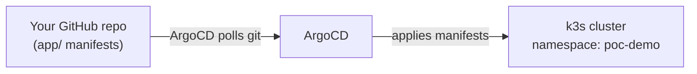

# GitOps Sentinel — Step 1: Deploy the toy app with ArgoCD

This is the beginner-friendly path: get a tiny demo app (`hello-caipe`)
running on your cluster **through ArgoCD**, so you can see GitOps working
end to end. CAIPE integration (chatops, auto-filed GitHub issues) is a later
stage — see [docs/caipe-integration.md](docs/caipe-integration.md) — and is
ignored completely here.

You already have both k3s and ArgoCD deployed, so this guide starts from
there.

## What you're building



You edit/push YAML to git. ArgoCD notices and applies it to the cluster.
You never run `kubectl apply` on the app yourself — that's the whole point
of GitOps: git is the source of truth, ArgoCD is the robot that keeps the
cluster in sync with it.

## Already done for you

- This folder is a local git repo (one commit) with the app manifests and
  the ArgoCD `Application`, remote `origin` set to
  `https://github.com/ponchotitlan/caipe-sentinel.git`.
- `argocd/application.yaml` already points at that repo/path.
- ArgoCD is exposed on your k3s node at NodePort `30080` (see
  [argocd/nodeport-service.yaml](argocd/nodeport-service.yaml)).

## What you need to do

### 1. Push this repo to GitHub

This couldn't be pushed automatically — the credentials cached in this dev
environment belong to a different GitHub account than `ponchotitlan`. From a
terminal authenticated as **you**:

```bash
cd /home/gitops-sentinel
git push -u origin main
```

If it asks for a password, GitHub no longer accepts your account password —
paste a [Personal Access Token](https://github.com/settings/tokens) instead,
or push over SSH if you have a key registered with GitHub.

### 2. Tell ArgoCD about the app

```bash
kubectl apply -f argocd/application.yaml
```

This creates one `Application` object named `hello-caipe` in the `argocd`
namespace — a YAML object that just says "watch this repo/path, put the
result in namespace `poc-demo`".

### 3. Watch it deploy

```bash
kubectl -n poc-demo get pods -w
```

Wait until you see 2 pods for `hello-caipe` in `Running`/`Ready` (Ctrl+C to
stop watching). First sync can take a few minutes (ArgoCD's default git
polling interval); to force it immediately:

```bash
kubectl -n argocd annotate application hello-caipe \
  argocd.argoproj.io/refresh=hard --overwrite
```

### 4. Check it in the ArgoCD UI (optional but satisfying)

- **URL:** whatever you pointed your Cloudflare Tunnel at, or
  `http://<k3s-node-ip>:30080`
- **Username:** `admin`
- **Password:**
  ```bash
  kubectl -n argocd get secret argocd-initial-admin-secret \
    -o jsonpath='{.data.password}' | base64 -d
  ```
  Change it after first login — this secret is only meant for bootstrapping.

You should see the `hello-caipe` app tile, "Synced" and "Healthy".

### 5. See the app actually respond

```bash
kubectl -n poc-demo port-forward svc/hello-caipe 8888:80
```

Then open `http://localhost:8888` — a tiny nginx page proving the deployment
is really running and reachable.

## Troubleshooting

| Symptom | Likely cause |
|---|---|
| `Application` shows no health/sync status | ArgoCD hasn't synced yet — force it with the `annotate ... refresh=hard` command above |
| Comparison/repo error in the UI | Step 1's push hasn't landed on GitHub yet, or the branch name doesn't match `argocd/application.yaml` |
| Pods stuck `Pending` | Check `kubectl -n poc-demo describe pod <name>` for the reason |

## What's next

Once `hello-caipe` is up and synced, move on to
[docs/caipe-integration.md](docs/caipe-integration.md) to wire in CAIPE:
chatops questions about the app, and an autonomous task that files a GitHub
issue when it detects drift or degraded health.

